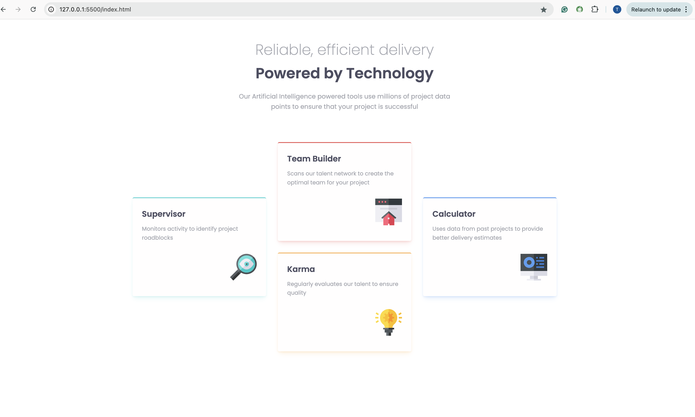

# Frontend Mentor - Four card feature section solution

This is a solution to the [Four card feature section challenge on Frontend Mentor](https://www.frontendmentor.io/challenges/four-card-feature-section-weK1eFYK). Frontend Mentor challenges help you improve your coding skills by building realistic projects.

## Table of contents

- [Overview](#overview)
  - [The challenge](#the-challenge)
  - [Screenshot](#screenshot)
  - [Links](#links)
- [My process](#my-process)
  - [Built with](#built-with)
  - [What I learned](#what-i-learned)
- [Author](#author)

## Overview

### The challenge

Users should be able to:

- View the optimal layout for the site depending on their device's screen size
  
  
  

### Links

- Solution URL: [https://github.com/Tainicknackz/four-card-feature-section](https://github.com/Tainicknackz/four-card-feature-section)
- Live Site URL: [gregarious-crumble-e3cdda](https://gregarious-crumble-e3cdda.netlify.app/)

## My process

### Built with

- Semantic HTML5 markup
- CSS custom properties
- FlexBox
- CSS FlexBox
- Mobile-first workflow

### What I learned

_Flex-box_, _align-self_ property in _Flex-box_, and _Media Queries_ were clear to me. How to keep columns responsive and scalable. **As shown below:-**

```HTML
<div class="box__ctn">
  <div class="box__item box__cyan"></div>
  <div class="box__rno">
    <div class="box__item box__red"></div>
    <div class="box__item box__orange"></div>
  </div>
  <div class="box__item box__blue"></div>
</div>
```

```CSS
/* Media Query for 1440px */
.box__ctn {
    display: flex;
    gap: 1.75rem;
    justify-content: center;
  }

  .box__item {
    width: 320px;
  }

  .box__item.box__cyan {
    align-self: center;
  }

  .box__item.box__blue {
    align-self: center;
  }
```

- Frontend Mentor - [@Tainicknackz](https://www.frontendmentor.io/profile/Tainicknackz)
- GitHub - [@Tainicknackz](https://www.github.com/Tainicknackz)
